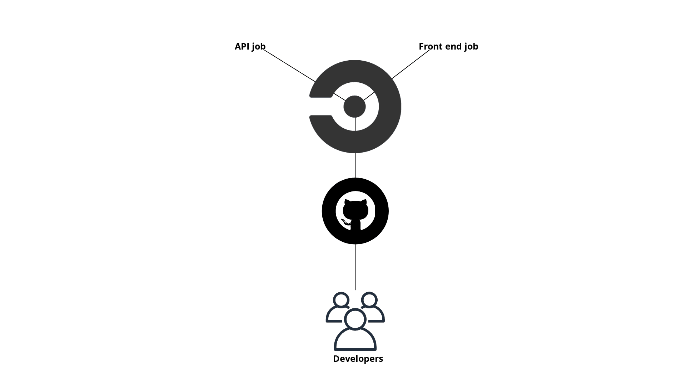

# Udagram Pipeline

## CI

- When the code is published to github, a signal is triggered to CircleCI platform to start deployment scripts(building both front and back end).

- Then CircleCI reads the `.circleci/config.yml` and runs 2 jobs:
  - Build frontend
  - Build api
- The jobs runs the `build` script provided in `package.json` then it deploys the code to AWS.
